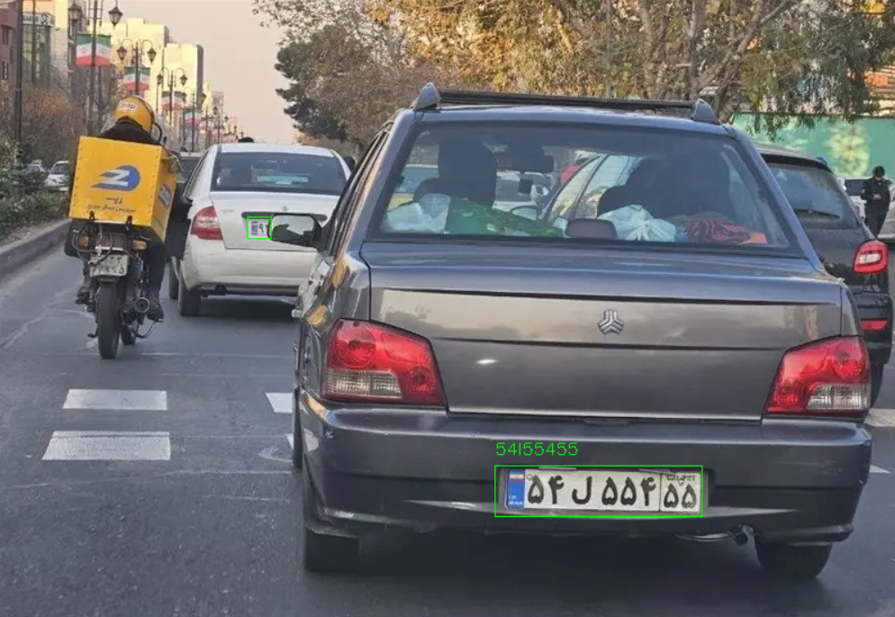
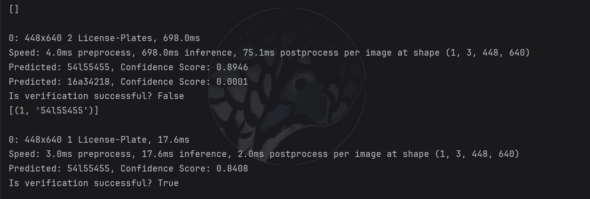

## License Plate Recognition

---
 - In this project, you can find car license plates and recognize them

## Key Features:

- Detect the license plate with [YOLOv11l](https://github.com/Eiliya-Zanganeh/Object-Detection-with-YOLOv11).
- Recognised the license plate with [DTRB](https://github.com/Eiliya-Zanganeh/Optical-Character-Recognition-OCR)
- Use Sqlite for verification section.

## Section of project:

- Detect the license plate.
- Recognised the license plate.

## Use of project in:

- Identification: Recognised license plate.
- Verification: Recognised license plate and check plate in database.

## How to use:

### 1 - Install Dependencies:

```shell
pip install -r requirements.txt
```

### 2 - Run test_identification.py for Identification:



### 3 - Run test_verification.py for Verification:



## Attention: dictionary of Persian alphabet.

```python
dict = {
        'A': 'الف',
        'B': 'ب',
        'P': 'پ',
        'T': 'ت',
        'Y': 'ث',
        'Z': 'ز',
        'X': 'ش',
        'E': 'ع',
        'F': 'ف',
        'K': 'ک',
        'G': 'گ',
        'D': 'D',
        'S': 'S',
        'J': 'ج',
        'W': 'د',
        'C': 'س',
        'U': 'ص',
        'R': 'ط',
        'Q': 'ق',
        'L': 'ل',
        'M': 'م',
        'N': 'ن',
        'V': 'و',
        'H': 'ه',
        'I': 'ی',
        '0': '۰',
        '1': '۱',
        '2': '۲',
        '3': '۳',
        '4': '۴',
        '5': '۵',
        '6': '۶',
        '7': '۷',
        '8': '۸',
        '9': '۹',
          '@': 'ویلچر',
    }
```